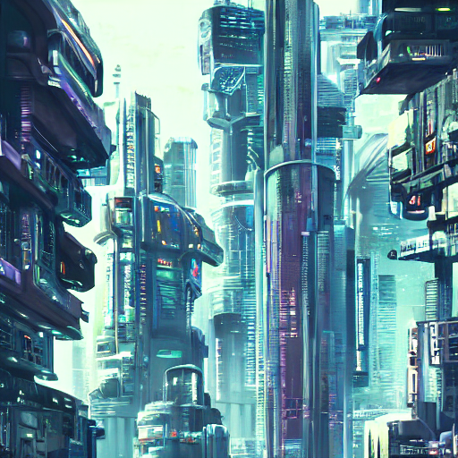

# 🚀 Enterprise Text-to-Image AI Generator

This project is an **Enterprise-Grade Text-to-Image AI Generator** powered by **Stable Diffusion**.  
It supports **Flask & FastAPI**, **Celery Async Processing**, **Database Logging**, **Real-ESRGAN Upscaling**, and **Docker & Kubernetes**.

---

## **📌 Project Overview**
This system allows users to generate high-quality AI images from text prompts using **Stable Diffusion**.  
It includes **asynchronous processing**, **image upscaling**, and is designed for **enterprise scalability**.

### **🌟 Features**
✅ **Flask & FastAPI API** (Flexible and Scalable)  
✅ **Celery Async Queue** (Efficient Background Processing)  
✅ **PostgreSQL & SQLite Support** (For Image Metadata Logging)  
✅ **Real-ESRGAN Upscaling** (High-Resolution Image Enhancement)  
✅ **Docker & Kubernetes** (Production-Ready Deployment)  
✅ **CLI Support for Local Image Generation**  
✅ **React Frontend (Coming Soon!)**  

---

## **🛠️ Setup Guide**
### **1️⃣ Create & Activate Conda Environment**
```sh
conda env create -f backend/environment.yml
conda activate text_to_image_enterprise
```

### **2️⃣ Run the Backend**
```sh
python backend/app.py
```

### **3️⃣ (Optional) Run the Frontend (Coming Soon)**
```sh
cd frontend
npm install
npm start
```

---

## **📡 API Usage**
### **1️⃣ Generate an Image via API**
**POST /generate**
```json
{
  "prompt": "A futuristic cyberpunk city",
  "output": "cyberpunk.png"
}
```
🔹 **Response:**
```json
{
  "message": "Image generated",
  "output": "outputs/cyberpunk.png"
}
```

---

## **🖥️ Using CLI for Local Image Generation**
You can run the image generation **directly from the command line** without using the API.

### **1 Generate an Image**
```sh
python backend/generate_image.py "A futuristic city at sunset with flying cars" --output futuristic_city.png
```

### **2️⃣ Upscale an Image Using Real-ESRGAN**
```sh
python backend/upscale_image.py --input futuristic_city.png --output futuristic_city_upscaled.png
```

> 📌 **Ensure Real-ESRGAN is installed and placed in the `real-esrgan/` directory**.

---

## **🐳 Docker & Kubernetes Deployment**
### **1️⃣ Run with Docker Compose**
```sh
docker-compose up --build
```

### **2️⃣ Deploy to Kubernetes**
```sh
kubectl apply -f k8s-deployment.yaml
```

---

## **🖼️ Example Generated Images**
| **Prompt** | **Generated Image** |
|------------|---------------------|
| *"A futuristic cyberpunk city"* |  |
| *"A breathtaking aerial view of NYC at sunset, ultra-HD photography"* |  |

> 📌 **Note:** Replace the image paths with actual generated images.

---

## **💡 Future Enhancements**
- ✅ **React Frontend UI (In Progress)**
- ✅ **Cloud Deployment Support (AWS/GCP)**
- ✅ **Fine-Tuning for Custom Models**
- ✅ **Multi-User Support with Auth System**

---

## **📜 License**
This project is **open-source** under the **MIT License**.

---
👨‍💻 **Developed by:** _Your Name / Team Name_  
📧 **Contact:** _your.email@example.com_  
🌍 **Website:** _[YourProjectWebsite.com](https://yourwebsite.com)_  
